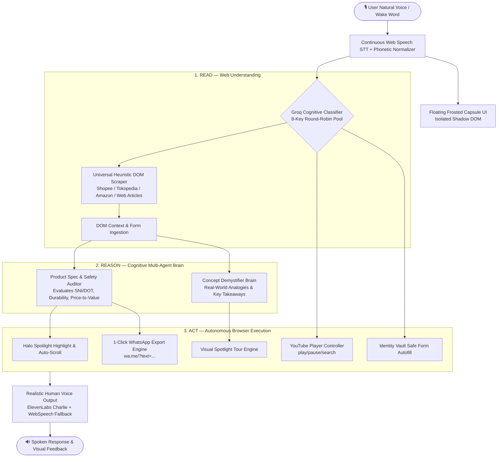

# 🌐 Vox Agent — Autonomous In-Browser AI Agent Helper

[](manifest.json)
[](https://groq.com)
[](https://elevenlabs.io)
[](https://anakin.io)
[](LICENSE)

> **Anakin Forge Hackathon: Build AI Agents That Read, Reason, and Act**  
> **Mission:** A living, voice-first autonomous AI Agent Helper that reads any live webpage, reasons through complex multi-step decisions, and executes actions directly in your browser without requiring manual clicks.

---

## 🌟 What is Vox Agent?

**Vox Agent** is an autonomous in-browser **AI Agent Helper** (Manifest V3 Chrome Extension) that lives as an intelligent floating capsule on any website you visit.

Unlike conventional chatbots that just talk in a static sidebar, Vox Agent is an **autonomous agent** with eyes and hands on the live web:
1. **READ**: Scrapes and interprets live DOM elements, product listings, pricing, technical jargon, media players, and forms in real-time.
2. **REASON**: Evaluates complex choices, audits products for safety and durability, formulates simple everyday analogies for tough concepts, and plans multi-step execution paths via Groq Cloud.
3. **ACT**: Controls media playback, audits marketplace items, generates 1-click WhatsApp research reports, fills forms from the encrypted Identity Vault, and guides users with synchronized visual Spotlight tours.

---

## ⚡ Core Capabilities & Use Cases

### 1. 🔍 Deep Live Marketplace Product Research & WhatsApp Export
- **Problem**: When browsing hundreds of items on marketplaces like Shopee, Tokopedia, or Amazon, picking the genuine best item is overwhelming and time-consuming.
- **Agent Behavior**: Say *"Hey Vox, can you do research for all this helmet in Shopee, tell me the reason, and send to WhatsApp"*.
- **Autonomous Flow**:
  - Vox audits all visible candidate items from the live DOM.
  - Passes items to the Groq Lead Product Researcher brain to evaluate safety certifications (SNI/DOT), visor quality, materials, and seller credibility.
  - Automatically auto-scrolls and highlights the winning product card on your screen with a glowing Cyan Halo Spotlight.
  - Generates a formatted summary card with 1-click **[📲 Kirim ke WhatsApp]** (`wa.me/?text=...`) and **[📋 Salin Ringkasan]** buttons.

### 2. 💡 Concept Demystifier & Explainer (Everyday Analogies)
- **Problem**: Landing on complex technical pages (e.g. Web3, decentralized protocols, zero-knowledge proofs, financial derivatives) leaves users confused.
- **Agent Behavior**: Say *"Web3 ini apa sih maksudnya, aku nggak ngerti"* or *"Explain this simply"*.
- **Autonomous Flow**:
  - Extracts page context and invokes the Demystifier Brain.
  - Explains the core idea using an intuitive everyday analogy (e.g., owning your house vs renting in a Big Tech building).
  - Outlines 3 key takeaways and reasons why it matters in clean, conversational speech.

### 3. 🎵 YouTube Media Playback & Song Discovery
- **Problem**: Manually switching tabs, typing into search bars, or clicking playback controls while multitasking interrupts your workflow.
- **Agent Behavior**: Say *"Hey Vox, can you play this song"*, *"Play Bohemian Rhapsody"*, or *"Pause"*.
- **Autonomous Flow**:
  - On YouTube: directly controls `<video>` playback (`play()`, `pause()`) or types and executes searches in the YouTube search bar.
  - On any other site: seamlessly opens YouTube in a new tab and searches the requested track.

### 4. 🔦 Visual Spotlight Guided Tours & Safe Autonomous Actions
- **Spotlight Tour**: Interactive multi-step visual walkthrough highlighting key page elements with synchronized voice narration.
- **Form Autofill & Identity Vault**: Fills complex address and checkout forms safely using encrypted local profiles (Home/Office).
- **Safe Mode**: High-risk actions (like payments) require explicit voice/click confirmation.

---

## 🛠️ Architecture & Flow



- **Isolated Shadow DOM**: UI injected cleanly into `document.body` inside an isolated Shadow Root so host CSS never breaks or conflicts.
- **Groq Cognitive Intent Classifier (`background.js`)**: Sub-second cognitive intent classification (500 tok/sec) with 8-Key Round-Robin rotator classifying utterances into `DEEP_RESEARCH`, `EXPLAIN_SIMPLY`, `MEDIA_CONTROL`, `SPOTLIGHT_TOUR`, etc.
- **Multi-Store DOM Scraper & Evaluator (`content.js`)**: Universal heuristic and semantic selectors extracting products across Shopee, Tokopedia, Amazon, and custom e-commerce stores.
- **Voice Engine**: Speech recognition with live transcription, acoustic word correction bar, speech sequence synchronization, and ElevenLabs ultra-realistic human male voice (*Charlie*).

---

## ⚡ How to Install in Google Chrome / Brave (Takes 10 Seconds)

1. Clone this repository:
   ```bash
   git clone https://github.com/IrrhammCode/VoxAgent.git
   cd VoxAgent
   ```
2. Open your browser and navigate to:
   ```text
   chrome://extensions
   ```
3. Enable **Developer mode** (toggle switch in the top-right corner).
4. Click the **"Load unpacked"** button in the top-left corner.
5. Select this cloned repository folder (`VoxAgent`).
6. **Done! 🎉** Vox Agent will now float as an intelligent living assistant on every website.

> **💡 Quick Sandbox Testing**: You can also test Vox Agent instantly without installing the extension by simply double-clicking [index.html](index.html) in your browser!

---

## 🎙️ Natural Voice & Text Commands

| Voice / Text Command | Action Executed by Vox Agent |
|---|---|
| *"What are you?"* / *"Kamu siapa?"* / *"Bisa apa aja?"* | Introduces Vox Agent as an Autonomous In-Browser AI Agent Helper with action chips. |
| *"Can you do research for all this helmet in Shopee..."* | Audits all candidate items on page, picks winner + reasons, offers WhatsApp export. |
| *"Web3 ini apa sih maksudnya, aku nggak ngerti"* | Explains the concept using intuitive real-world analogies and key takeaways. |
| *"Can you play this song"* / *"Putar lagu [nama]"* / *"Pause"* | Controls YouTube playback or searches and plays songs hands-free. |
| *"Tour halaman ini"* / *"Show me around"* | Launches interactive visual Spotlight tour highlighting key areas of the page. |
| *"Isi alamat pengiriman"* / *"Fill shipping address"* | Autofills forms from active Identity Vault profile. |
| *"Reset data"* / *"Restart mic"* | Resets all agent state and local storage instantly. |

---

## 🧪 Judge Evaluation Script (3-Minute Walkthrough)

To experience the full power of Vox Agent during grading, try these 3 live scenarios:

### Scenario 1: Deep Marketplace Product Research & WhatsApp Export
1. Navigate to any marketplace search results page (e.g. search for **"helm bogo"** or **"mechanical keyboard"** on Shopee, Tokopedia, or Amazon).
2. Say:
   > *"Hey Vox, can you do research for all this helmet and send to WhatsApp?"*
3. **Observation**:
   - Vox Agent inspects candidate products directly from the screen.
   - Evaluates specs, ratings, and certifications.
   - Automatically auto-scrolls and highlights the winning product with a glowing Cyan Halo Spotlight.
   - Generates an executive summary card with a 1-click **[📲 Kirim ke WhatsApp]** button.

### Scenario 2: Technical Concept Demystifier (Everyday Analogies)
1. Open any complex technical page (e.g. an article on Web3, zero-knowledge proofs, or quantum computing).
2. Say:
   > *"Web3 ini apa sih maksudnya, jelaskan secara sederhana"* or *"Explain this simply"*
3. **Observation**:
   - Vox Agent breaks down the concept into an everyday analogy (e.g., owning property vs renting in Big Tech).
   - Speaks the explanation smoothly with human inflection and displays 3 practical takeaways.

### Scenario 3: Hands-Free YouTube Media Control
1. From any tab, say:
   > *"Hey Vox, play Bohemian Rhapsody on YouTube"*
2. **Observation**:
   - Vox Agent immediately navigates to YouTube, enters the search query, and starts playback.
   - Say *"Hey Vox, pause"* or *"Pause"* to pause playback hands-free.

---

## 📂 Project Structure

```text
VoxAgent/
├── manifest.json       # Chrome Extension Manifest V3 configuration
├── background.js       # Service worker: Groq cognitive classifier, Anakin & ElevenLabs proxy
├── content.js          # In-page agent engine: isolated Shadow DOM capsule, DOM scraper, voice logic
├── content.css         # Minimal root styles for Shadow DOM host
├── config.js           # Extension runtime environment configuration (fallback keys)
├── index.html          # Interactive standalone browser simulator for zero-install demo
├── icons/              # Extension icons (16x16, 48x48, 128x128)
├── .env.example        # Template for API credentials
├── .gitignore          # Keeps secrets and OS files private
└── README.md           # Architecture, guide, and judge evaluation script
```

---

## 🏆 Key Innovations & Hackathon Highlights

1. **Zero-Rate-Limit Architecture**: 8-key round-robin Groq rotator capable of handling 210+ requests/minute with sub-second latency.
2. **Real-World Actionability**: Not just an LLM chatbox in a sidebar — Vox physically highlights elements, triggers YouTube video elements, fills encrypted identity forms, and bridges research to WhatsApp Web.
3. **Acoustic Robustness**: Features continuous hands-free listening, phonetic normalization (*"vos"* → *"vox"*), conversational transition stripping (*"terus what is this"* → *"what is this"*), and zero-collision speech serialization.
4. **Dual Deployment Mode**: Runs as a full Manifest V3 Chrome Extension on any live website worldwide, and includes a standalone offline browser simulator (`index.html`) for instant sandbox testing.
